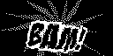

# Fighting Words

Generates black-and-white images suitable for a 128x64 OLED display in the style of the onomatopoetic fighting words used in the old [Batman TV series]. This repository includes in `words.txt` all the [bat-fight words] used in the series.

[batman tv series]: https://en.wikipedia.org/wiki/Batman_(TV_series)
[bat-fight words]: https://www.66batmania.com/trivia/bat-fight-words/
[badaboom]: https://blambot.com/collections/sound-effect-fonts/products/badaboom

## Running the script

To run against the contents of `words.txt`:

```
uv run fighting-words.py
```

To run against your own word list:

```
uv run fighting-words.py path/to/your/wordlist.txt
```

## Usage

```
usage: fight_word_generator.py [-h] [--font FONT_NAMES] [--output OUTPUT_DIR]
                               [--negate] [--distortion DISTORTIONS]
                               [input_file]

Generate Batman-style fight word images

positional arguments:
  input_file            Input file containing fight words (default: words.txt)

options:
  -h, --help            show this help message and exit
  --font FONT_NAMES     Comma-separated list of font paths or names (e.g.,
                        arial.ttf,helvetica.ttf)
  --output OUTPUT_DIR   Output directory (default: output)
  --negate              Reverse colors (white text on black background)
  --distortion DISTORTIONS
                        Comma-separated list of distortions to apply
                        (shear,fisheye,perspective). Default: all
```
